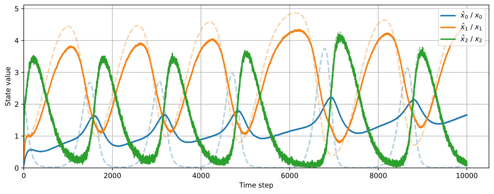

# Online Generalised Predictive Coding through Online Dynamic Expectation Maximisation (ODEM)

A Python/PyTorch implementation of **Online Dynamic Expectation Maximisation (ODEM)** for **Online Generalised Predictive Coding** under the **Free Energy Principle (FEP)**.

ODEM extends Dynamic Expectation Maximisation (DEM) to online data assimilation through a separation of temporal scales, enabling the joint inference of:

- Hidden dynamic states  
- Unknown model parameters  
- State and observation uncertainty (precision estimation)

This repository implements neuronal message passing in a one-layer Predictive Coding (PC) network using Python and PyTorch on CPU.

---

<p align="center">
  
  <br>
  <em>
  Figure 1: State estimation using a Lorenz generative model versus a Generalised Lotka–Volterra generative process (i.e., under model mismatch) using ODEM with three orders of generalised coordinates of motion. Despite structural mismatch between the generative model and process, the inferred trajectory closely tracks the true latent dynamics.
  </em>
</p>

---

# Features

- Online variational inference using ODEM
- Predictive Coding under the Free Energy Principle
- Joint state, parameter, and precision estimation (triple estimation)
- Support for nonlinear and potentially chaotic dynamical systems
- Generalised coordinates of motion
- Implemented using PyTorch
- Configurable experiments via YAML files

---

# Repository Structure

```text
ODEM/
│
├── algorithms/          # Core ODEM implementation
├── example/             # Example figures and outputs
├── parameters.yaml      # Main configuration file
├── main.py              # Entry point
├── requirements.txt     # Required Python packages
└── README.md
```

---

# Installation

## 1. Clone the repository

Choose a directory where you would like to clone the repository:

```bash
cd MY_DIRECTORY
```

Clone the repository:

```bash
git clone https://github.com/MLDawn/ODEM.git
```

Go into the cloned repository:

```bash
cd ODEM
```

---

## 2. Create a Conda environment

Create a new Conda environment with Python 3.11.5:

```bash
conda create -n ENVIRONMENT_NAME python=3.11.5
```

Activate the environment:

```bash
conda activate ENVIRONMENT_NAME
```

---

## 3. Install required packages

Install all required dependencies using the provided `requirements.txt` file:

```bash
pip install -r requirements.txt
```

---

# Running the Code

## 1. Configure the experiment

Open the `parameters.yaml` file and modify the configuration parameters as desired.

---

## 2. Open the project in your IDE

For example:

- PyCharm
- VSCode

Assign your Conda environment (`ENVIRONMENT_NAME`) as the Python interpreter.

---

## 3. Run the main script

Execute:

```bash
python main.py
```

---

# Example Experiments

The repository includes experiments involving nonlinear dynamical systems such as:

- Lorenz systems
- Generalised Lotka–Volterra systems

The framework supports both:

- Matched generative model and process settings
- Model mismatch scenarios

---

# Citation

If you use this codebase in your research, please cite:

```bibtex
@article{bazargani2026online,
  title={Online Generalised Predictive Coding},
  author={Bazargani, Mehran HZ and Urbas, Szymon and Razi, Adeel and Murphy, Thomas Brendan and Friston, Karl},
  journal={arXiv preprint arXiv:2605.02675},
  year={2026}
}
```

# License

Please refer to the repository license for usage conditions.

---

# Contact

For questions, collaborations, or issues related to the repository, please open an issue on GitHub.

GitHub Repository: [ODEM Repository](https://github.com/MLDawn/ODEM?utm_source=chatgpt.com)